# 類音検索ツール（Sound-Alike Search）つかいかた

アーカイブは展開直後、以下のようになっています。  
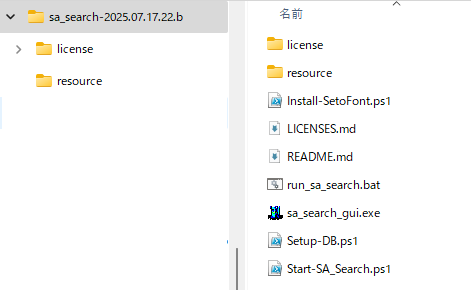  
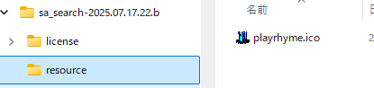

---

## 初回起動（失敗）

1. `run_sa_search.bat` をダブルクリック  
2. データベースが存在しない状態のため、起動に失敗します。  
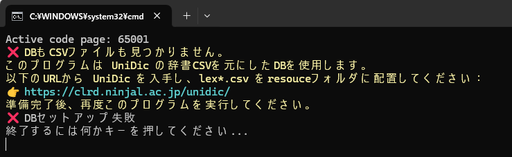

---

## 初回起動（事前準備あり）

1. UniDicから辞書アーカイブを入手して、**lex*.csv** を `resource/` に格納してください。  
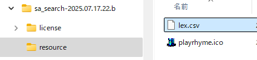

2. `run_sa_search.bat` をダブルクリック  
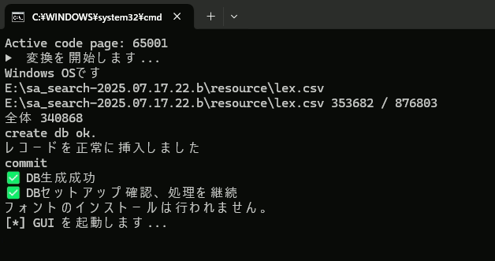

3. データベースが作成され、GUIが起動します。  
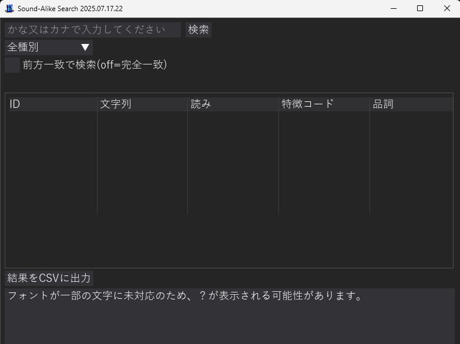

---

## DBセットアップ後の起動
DBのセットアップが終わった状態になった後は、実行モジュールを直接ダブルクリックで起動してかまいません。

---

## 瀬戸フォントの適用

1. 瀬戸フォントのアーカイブファイルを「窓の杜」などから入手し、そのまま `resource/` に格納してください。  
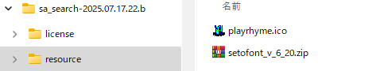

2. `run_sa_search.bat` をダブルクリックすると、フォントのインストール確認が表示されます。`y` を押して進んでください。  

3. フォントファイルが `resource/` に展開され、以後GUIでは当該フォントが利用されるようになります。

---

## 検索
1. GUIの左上にあるエディットボックスに　かな　又は　カナ　で検索したい文字列を入力してください。
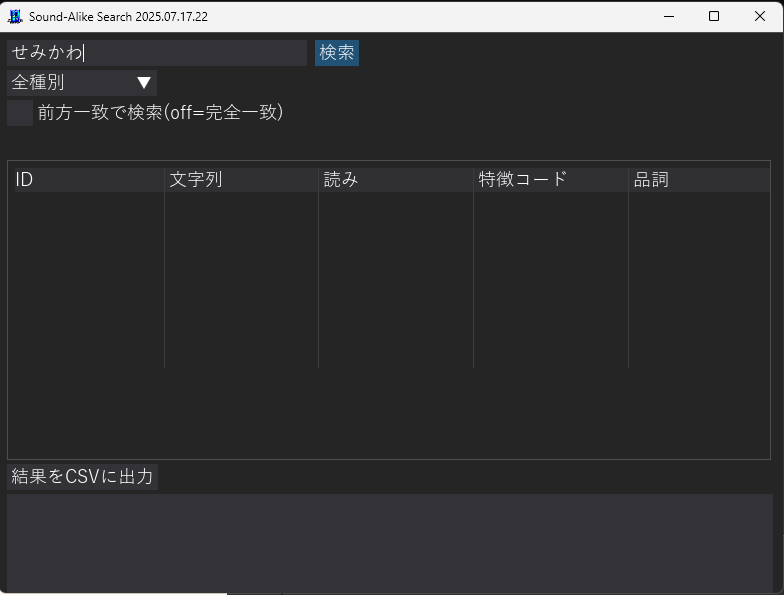

2. エディットボックスの右にある「検索」ボタンをクリック。

3. 少しののち、画面中断に類音と判定された情報のリストが表示されます。
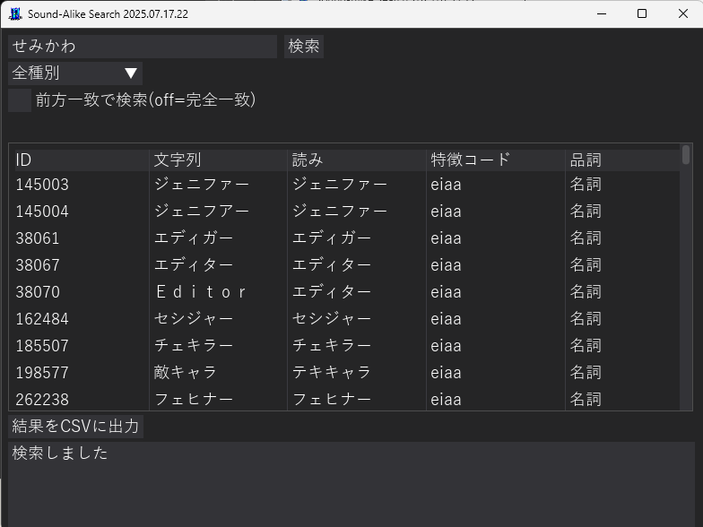

エディットボックスの下にあるコンボボックスは、結果に表示されている「品詞」を検索時に絞り込む設定です。
コンボボックスの下にあるチェックボックスは、検索時に「前方一致（検索した文字列に該当するものが登録文字列の先頭に合致する）」で検索を行う設定にするためのものです。

---

## CSV出力
検索結果は膨大な場合があるため、CSVファイルに出力できるようになっています。
1. 検索語、検索結果リストの下にある「結果をCSVに出力」ボタンを押下してください。出力処理が始まり、プログレスバーが表示されます。
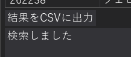
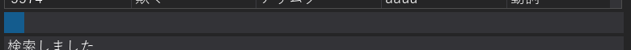

2. CSV出力が終わるとプログレスバーが非表示になり、どこに出力されたか、ログ表示されます。
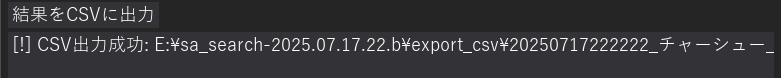
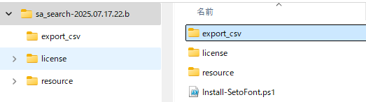
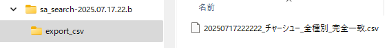

（※ここに出力手順や注意点を記載予定）
